## Ejercicio 1

**Instalar etcd3, averiguar qué bibliotecas funcionan bien con el lenguaje que estemos escribiendo el proyecto (u otro lenguaje), y hacer un pequeño ejemplo de almacenamiento y recuperación de una clave; hacer el almacenamiento desde la línea de órdenes (con etcdctl) y la recuperación desde el mini-programa que hagáis.**

Primero instalamos etcdtl tanto cliente como servidor

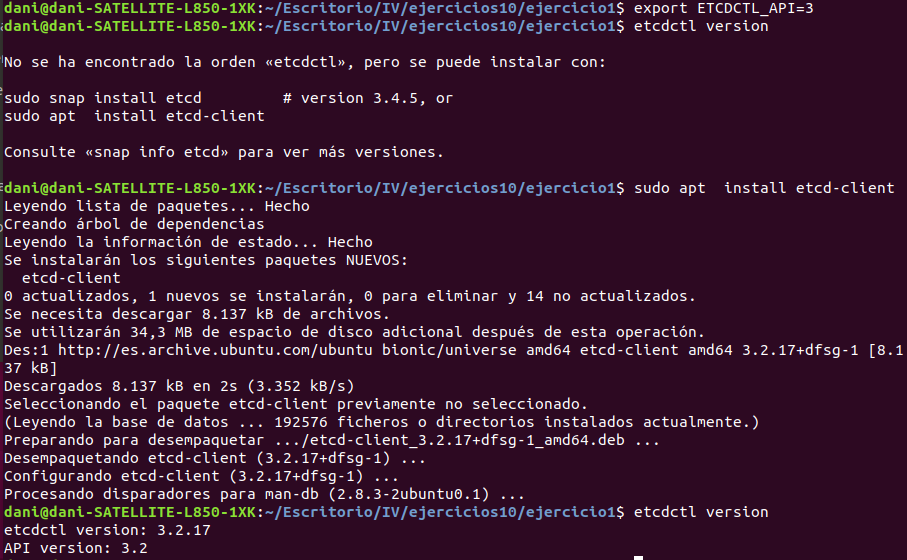

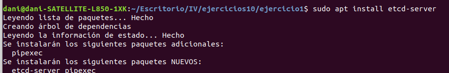

Primero instalamos etcdtl guardamos la clave desde la línea de comandos

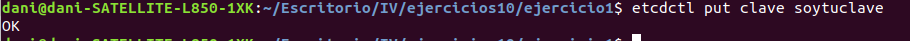

instalamos en nuestro proyecto etcd para utilizarlo

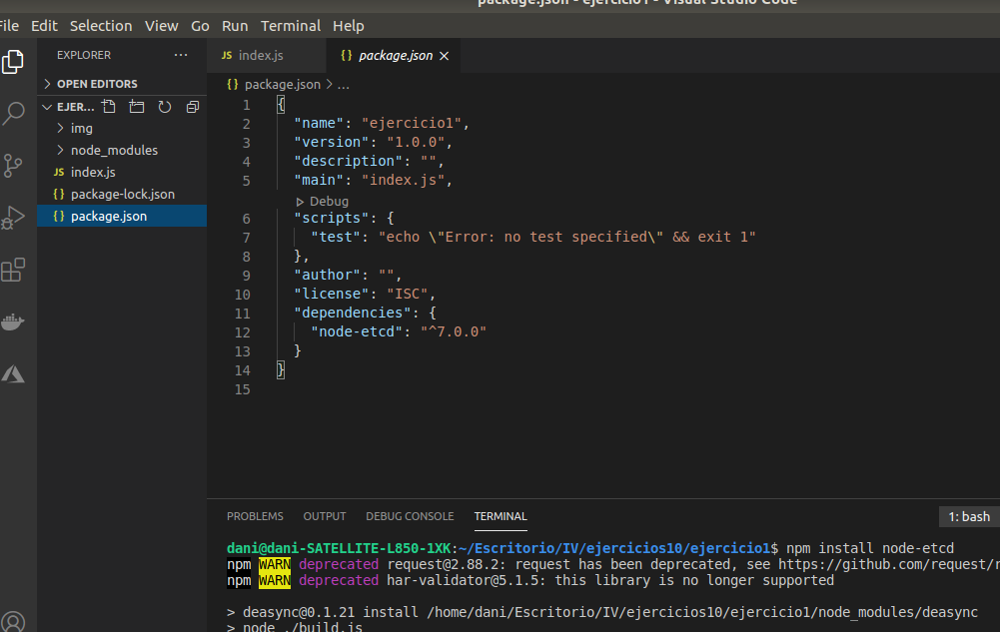

y hacemos el programa que muestra la clave insertada anteriormente desde la línea de comandos

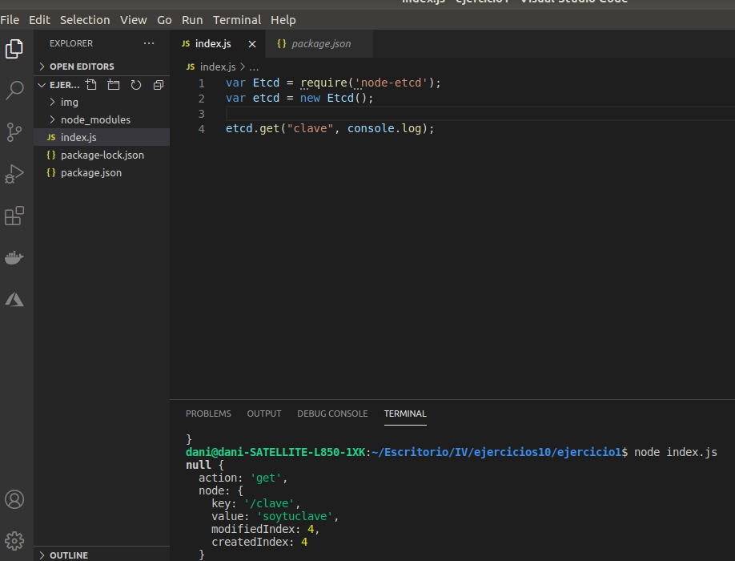
                   
## Ejercicio 2
**Realizar una aplicación básica que use express para devolver alguna estructura de datos del modelo que se viene usando en el curso.**

Primero creamos la aplicación básica que usa express y que devuelve un json.

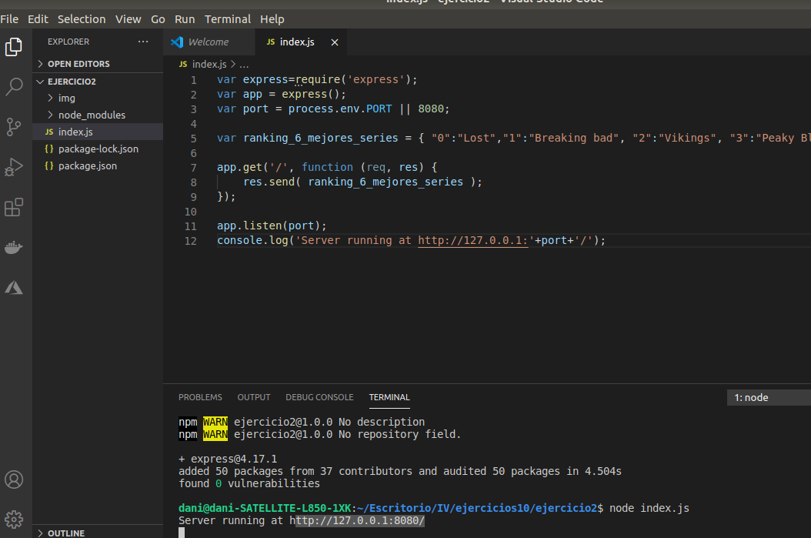

Aplicación funcionando

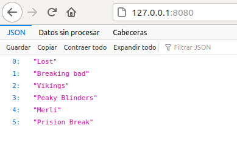
 
## Ejercicio 3
**Programar un microservicio en express (o el lenguaje y marco elegido) que incluya variables como en el caso anterior.**

Esta es la aplicación creada que utiliza las variables mencionadas anteriormente.

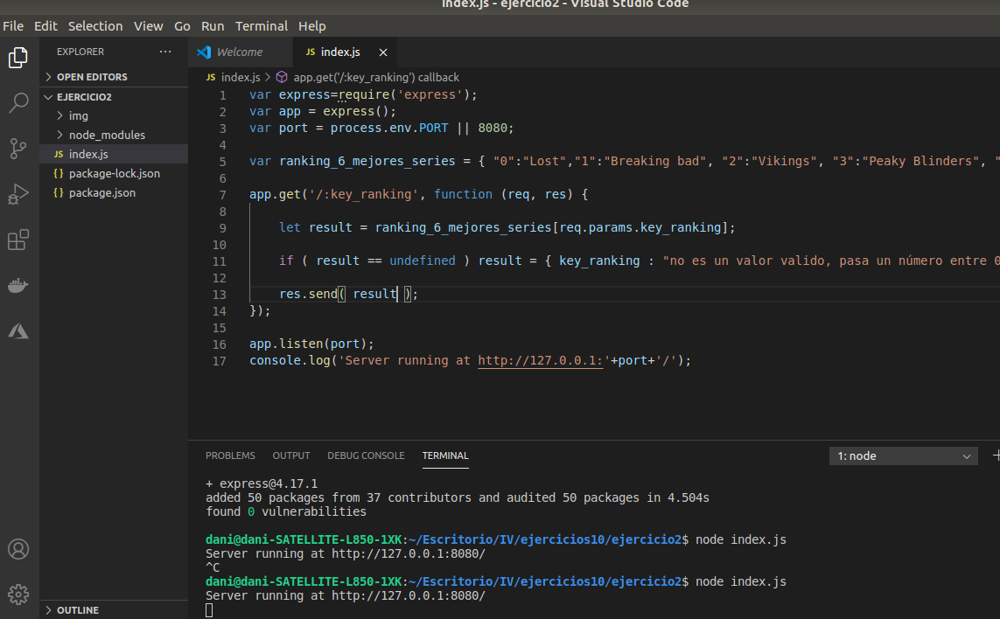

Resultado correcto

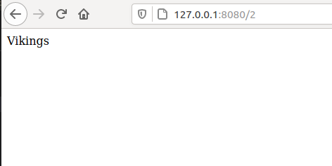

Resultado no se recibe lo esperado

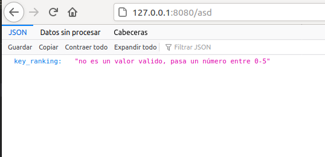
 
## Ejercicio 4
**Crear pruebas para las diferentes rutas de la aplicación.**

Creamos el programa y añadimos las librerías necesarias para hacer los test de integración

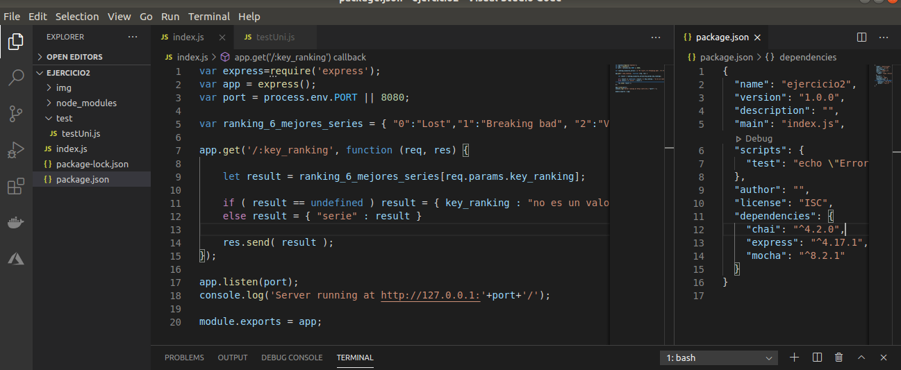

creamos los test y los ejecutamos

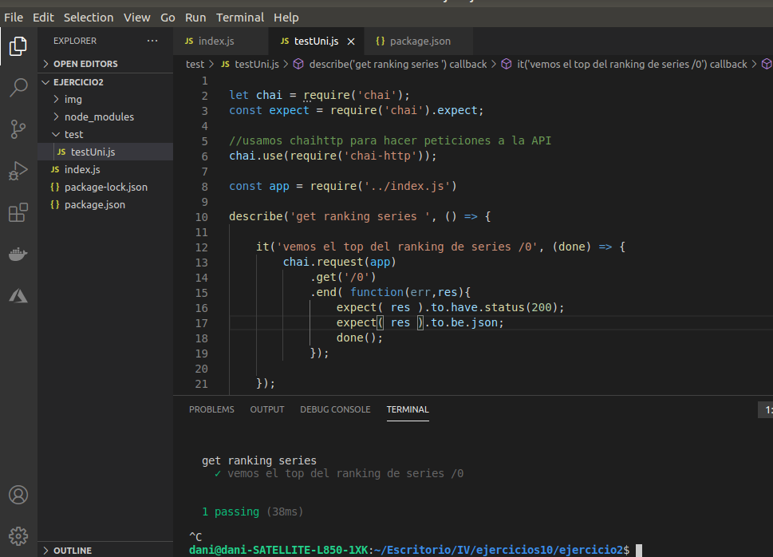
 
## Ejercicio 5
**Experimentar con diferentes gestores de procesos y servidores web front-end para un microservicio que se haya hecho con antelación, por ejemplo en la sección anterior.**

Instalamos pm2 

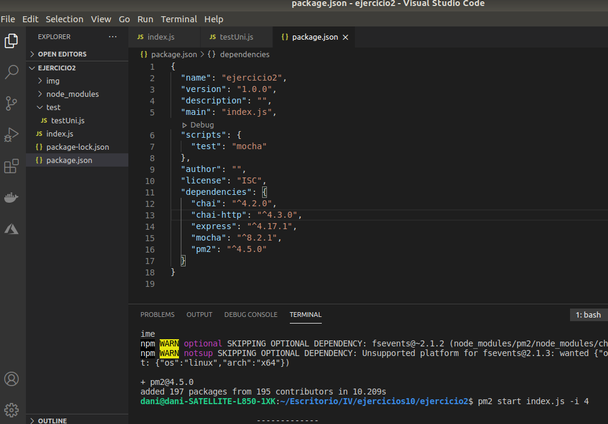

y arrancamos 4 instancias 

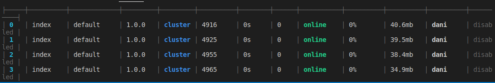

vemos los logs de los procesos

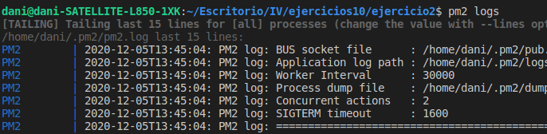

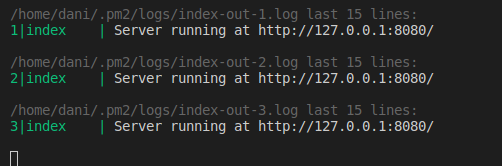

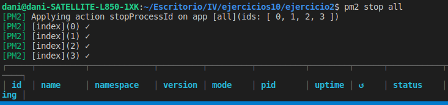

probamos otro gestor de procesos forever

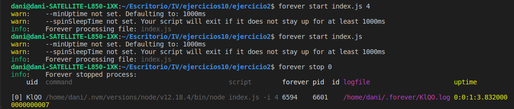
 
## Ejercicio 6
**Usar rake, invoke o la herramienta equivalente en tu lenguaje de programación para programar diferentes tareas que se puedan lanzar fácilmente desde la línea de órdenes.**

Instalamos grunt y creamos nuestro fichero Gruntfile con todas las tareas a ejecutar start/test...

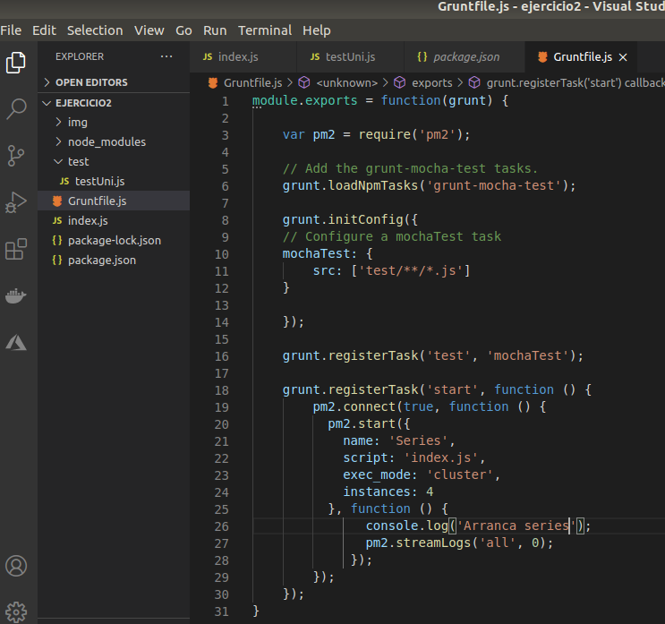

y las probamos

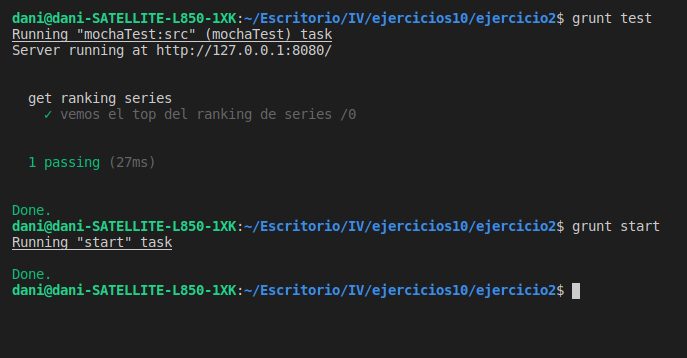
