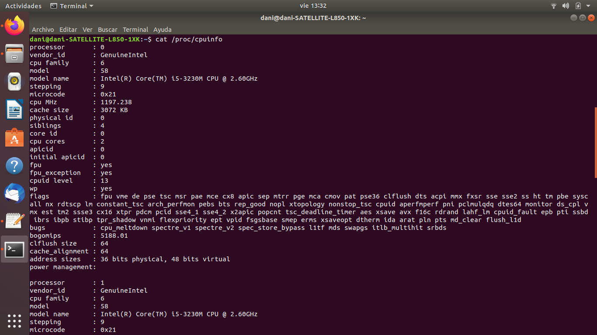
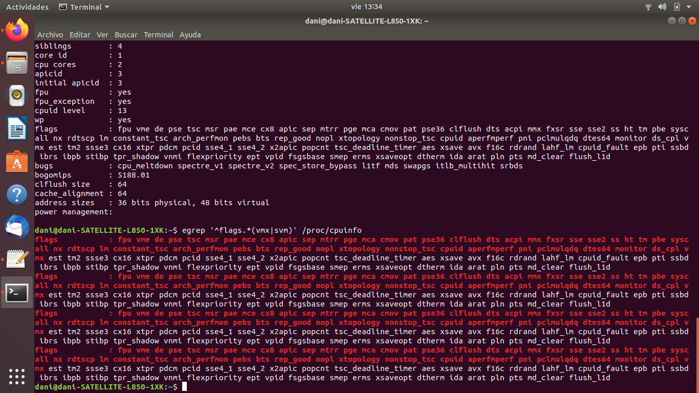
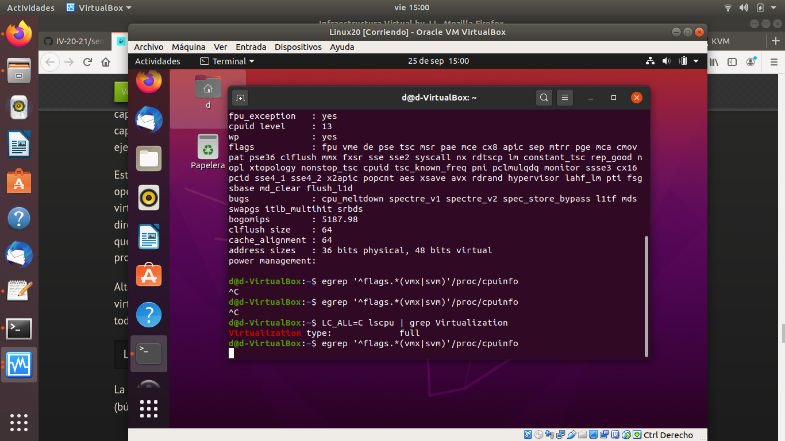

# Ejercicio 1
**Consultar en el catálogo de alguna tienda de informática el precio de un ordenador tipo servidor y calcular su coste de amortización a cuatro y siete años.**
> El catalogo consuldado ha sido &reg;Dell y el servidor elegido es el siguiente [servidor](https://www.dell.com/es-es/work/shop/cty/pdp/spd/poweredge-m640/emea_m640_vi_vp).

1. Primero calculamos su 21% de IVA
> 20.534,81 * 21/100 = 4312,31€
> 20.534,81 + 4312,31 = 24847,12€

2. Calculamos el coste de amortización anual para 4 y 7 años, sabiendo que el maximo de amortizacion anual es 25%.
> Para 4 años: 25/100 * 24847,12 = 6211,78€

> Para 7 años:
Primero calculamos el porcentaje que se pagara anualmente.
	100/7 =  14,3%
Luego el coste de amortización anual es: 14,3/100 * 24847,12 = 3553,14€

# Ejercicio 2
**Usando las tablas de precios de servicios de alojamiento en Internet “clásicos”, es decir, que ofrezcan Virtual Private Servers o servidores físicos, y de proveedores de servicios en la nube, comparar el coste durante un año de un ordenador con un procesador estándar (escogerlo de forma que sea el mismo tipo de procesador en los dos vendedores) y con el resto de las características similares (tamaño de disco duro equivalente a transferencia de disco duro) en el caso de que la infraestructura comprada se usa solo el 1% o el 10% del tiempo**
> Este es el [servidor virtual privado](https://www.ovhcloud.com/es/vps/) que he elegido con la configuracion media baja en la cual pagando 10,58€ al mes tenemos 2vCore, 4GB RAM, 80GB SSD de almacenamiento y 500 Mbit/s ilimitado de ancho de banda.

Su coste en un año sería de 126,96€

>Para [servicio en la nube](https://azure.microsoft.com/es-es/services/virtual-machines/#pricing) con unas caracteristica casi similares 2vCPU y 4GB RAM el precio es de 0,072€ por hora.

Suponiendo que se usa el 10% del tiempo de 1 dia.
> 24 * 10/100 = 2,4 horas de uso diario
> Luego al dia cuesta 0,18€, al mes 5,2€ y al año 62,21€

**En conclusion** vemos que cloud es mas rentable si es utilizado solo ese 10% del día y en este por lo general solo pagamos lo que utilizamos. Mientras que en el servidor privado tenemos siempre un coste fijo de algo que se puede utilizar o no, depende del servicio que se ofrezca sera mas rentable uno u otro.

# Ejercicio 3
**En general, cualquier ordenador con menos de 5 o 6 años tendrá estos flags. ¿Qué modelo de procesador es? ¿Qué aparece como salida de esa orden? Si usas una máquina virtual, ¿qué resultado da? ¿Y en una Raspberry Pi o, si tienes acceso, el procesador del móvil?**
El modelo de procesador es el que se muestra en la siguiente imagen.
> 
Como salida de la orden egrep `'^flags.*(vmx|svm)' /proc/cpuinfo` podemos ver los flags que tiene nuestra CPU
> 
Cuando probamos esta orden en una maquina Virtual, ocurre lo citado no lista nada pues la funcionalidad o esta desactivada o no existe.
> 

# Ejercicio 4
**Instalar un hipervisor para gestionar máquinas virtuales, que más adelante se podrá usar en pruebas y ejercicios. Usar siempre que sea posible un hipervisor que sea software libre.**
