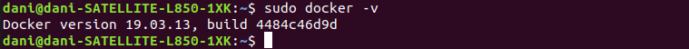
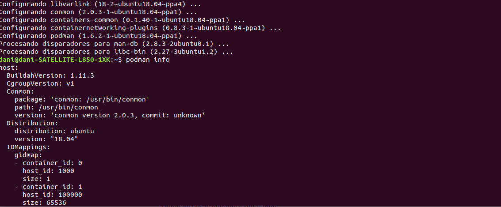
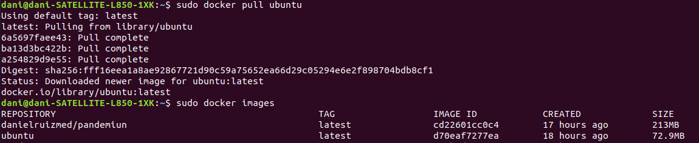
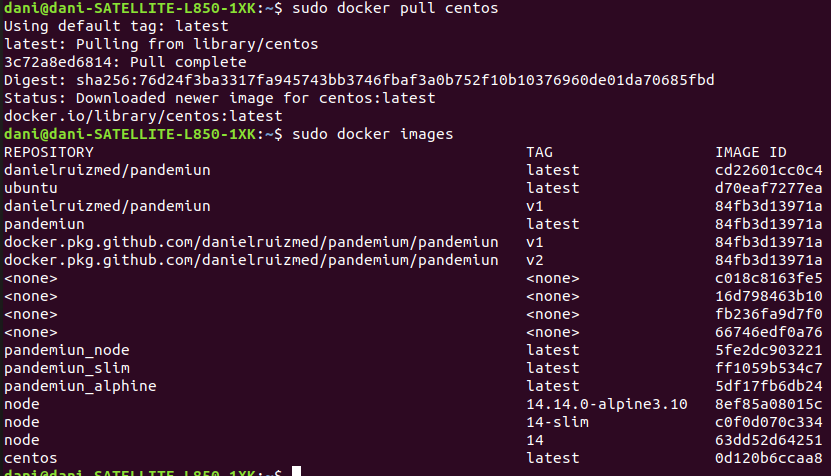
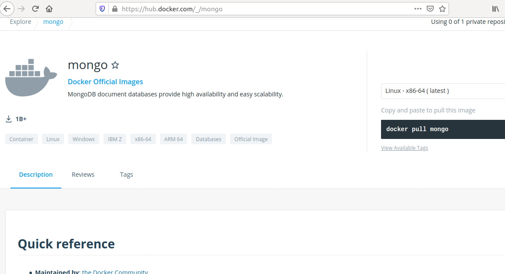
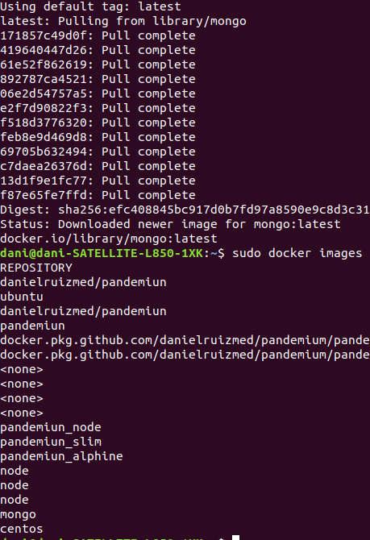
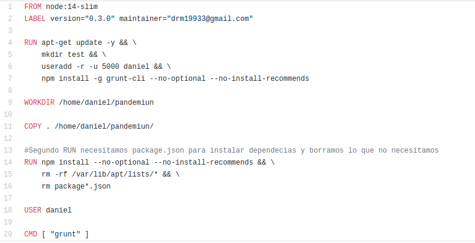
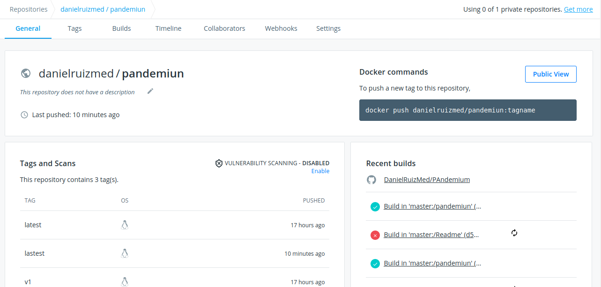
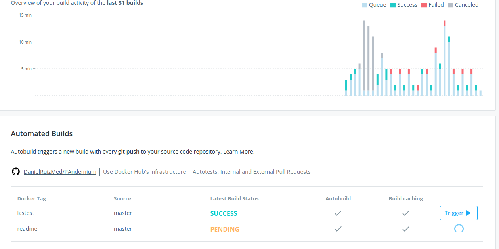
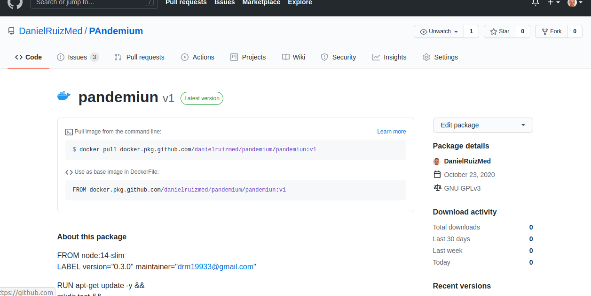

# Ejercicio 1
**Instalar docker y/o otro gestor de contenedores como Podman/Buildah**

Docker instalado

Podman instalado

# Ejercicio 2
**1. Instalar a partir de docker una imagen alternativa de Ubuntu y alguna adicional, por ejemplo de CentOS**

Instalando Ubuntu

Instalando CentOs

**2. Buscar e instalar una imagen que incluya MongoDB.**

Instalando Mongo, primero lo busco en DockerHub y despues lo installo

# Ejercicio 5
**Crear un Dockerfile para el servicio web que testee la clase que se ha venido desarrollando hasta ahora.**

# Ejercicio 6
**Desplegar un contenedor en alguno de estos servicios, de prueba gratuita o gratuitos.**

Servicio Desplegado en DockerHUb, con build que actualizan la imagen cuando se modifica el fichero Dockerfile de Github.

Servicio desplegado en Github

