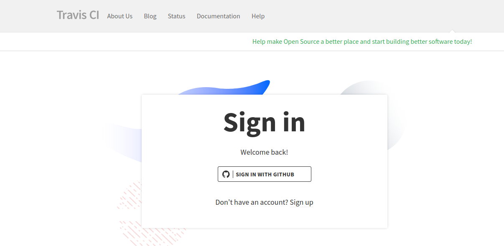
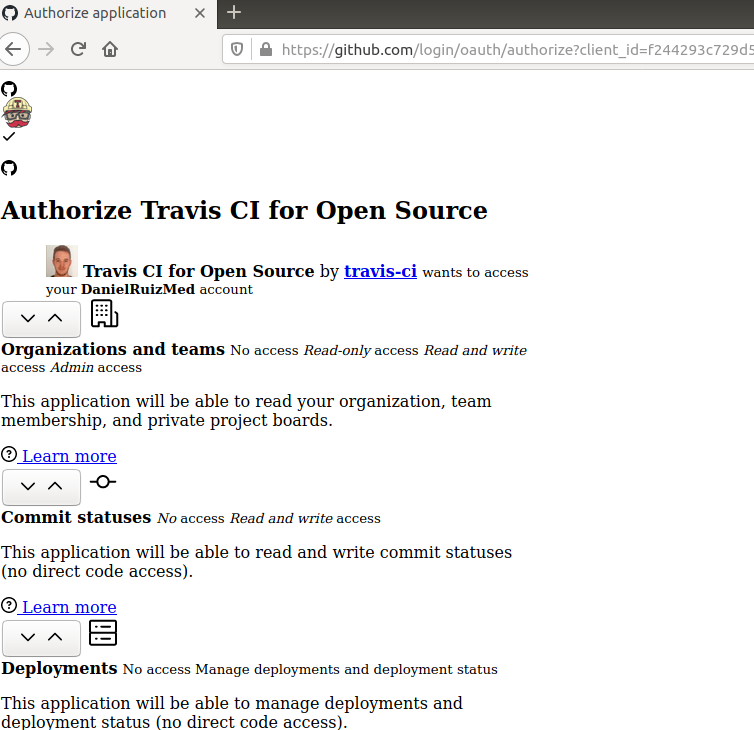
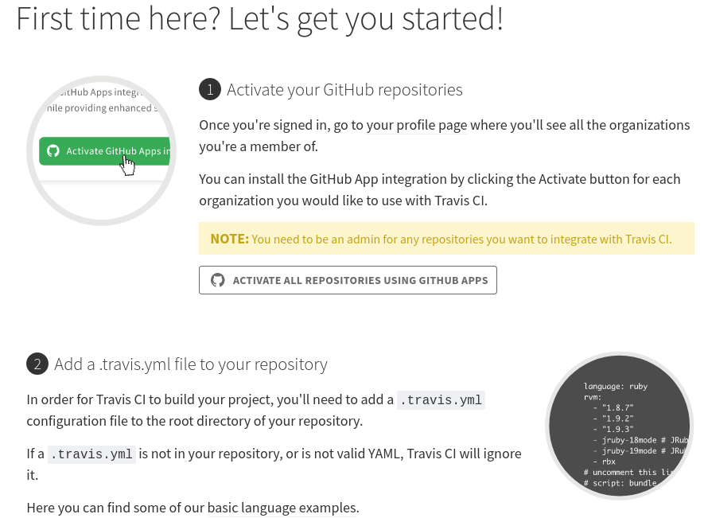
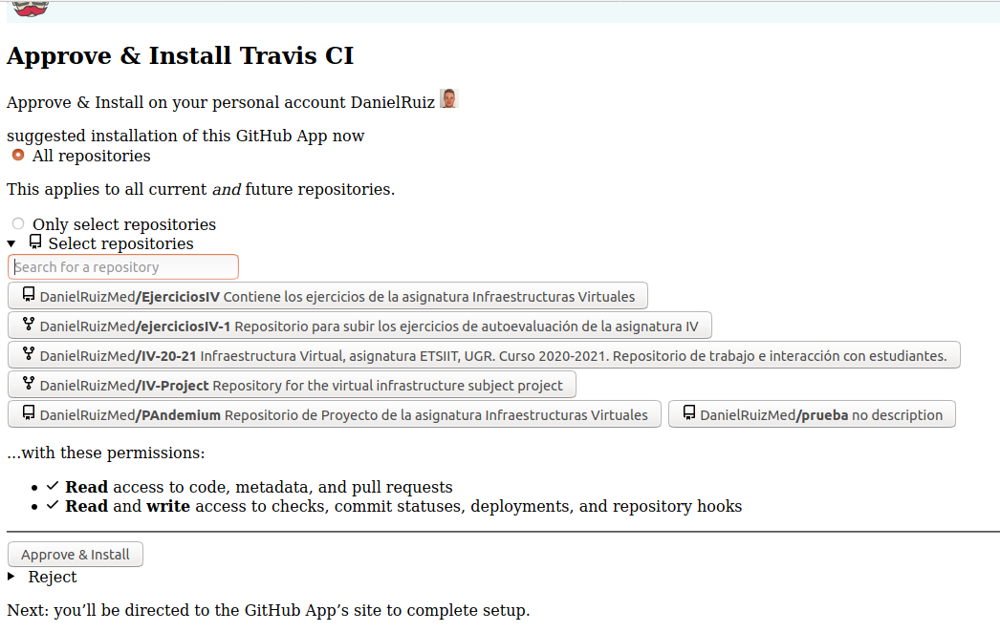
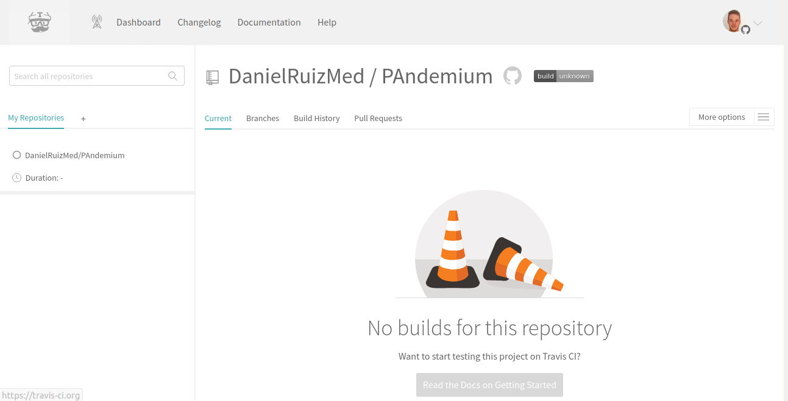
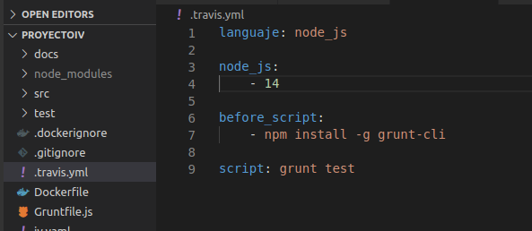
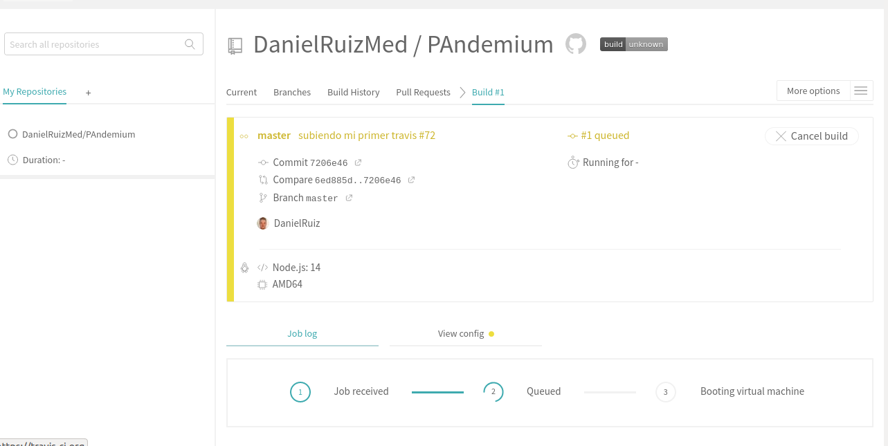
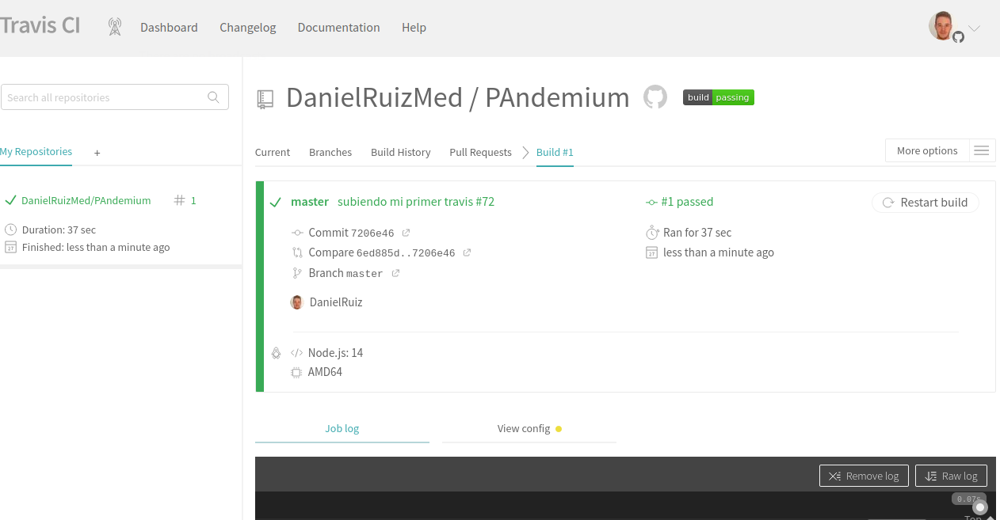
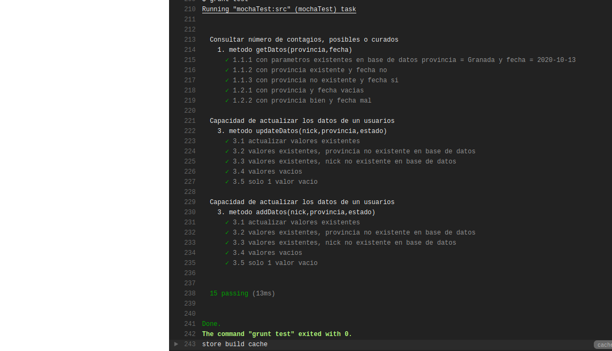

 
## Ejercicio 9
**Haced los dos primeros pasos antes de pasar al tercero.**
 
Primero entramos en travis-ci.com y nos registramos con nuestra cuenta de Github
 

 
Esta nos redirige a Github donde nos pide que otorgamos privilegios a Travis y se instala
 

 
Tras esto nos sale un tríptico donde nos dice los pasos a seguir para crear una build de travis de alguno de nuestros repositorios, pulsamos en ACTIVATE ADD REPOSITORIES ...
 

 
Este nos redirige a Github y donde indicaremos si queremos activar todos o alguno en especial, en nuestro caso elegimos Pandemium, que es el proyecto con el que deseamos trabajar.
 

 
Tras esto vemos como nos aparece el proyecto añadido en la barra lateral izquierda en el que aparece nuestro repositorio Pandemium en el cual no hemos todavía añadido .travis.yml
 

 
## Ejercicio 10
**Configurar integración continua para nuestra aplicación usando Travis o algún otro sitio.**
 
El sitio elegido para configurar integración continua ha sido Travis, para esto tras el registro y activación del repositorio como vemos en el ejercicio anterior, hemos creado el fichero .travis.yml y lo hemos subido a nuestro repositorio.
 
En este archivo indicamos el lenguaje que usaremos Nodejs, la versión de node, lanzaremos script necesarios antes de ejecución y ejecutaremos los test.
 

 
Tras hacer push a Github, travis ejecutará su build esto puede tardar varios minutos.
 

 
Y si todo es correcto nos aparecerá todo en verde
 

 
Y nos mostrará la respuesta de que los test se han pasado correctamente.
 

