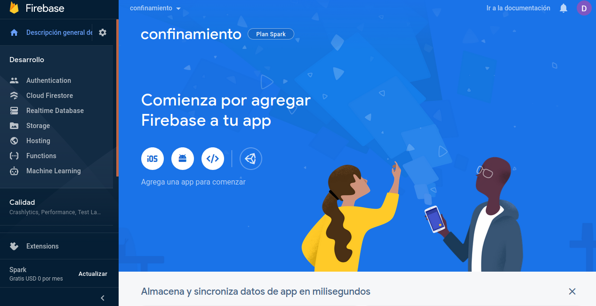
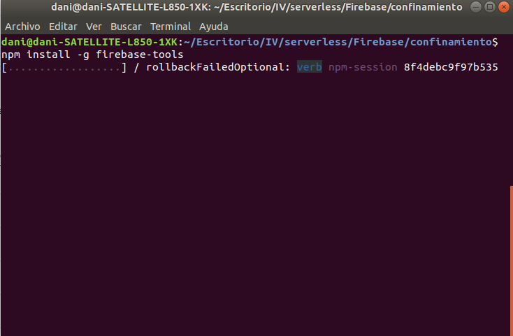
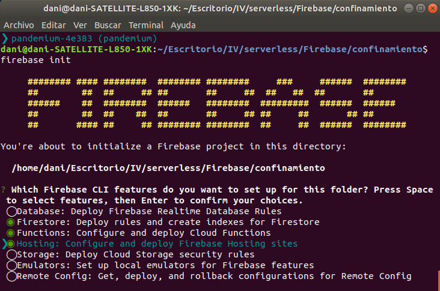
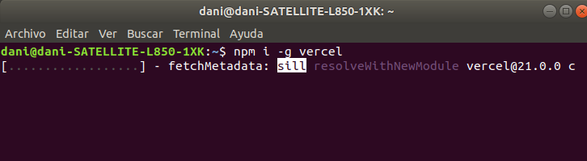
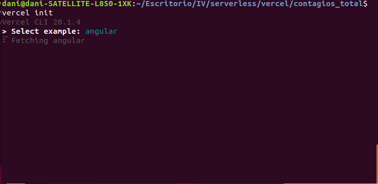
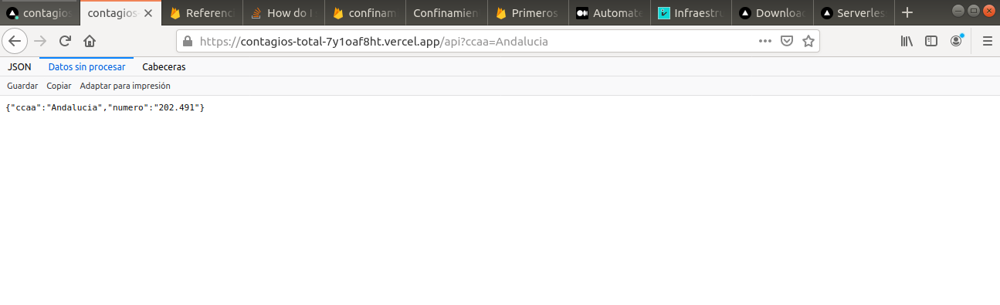
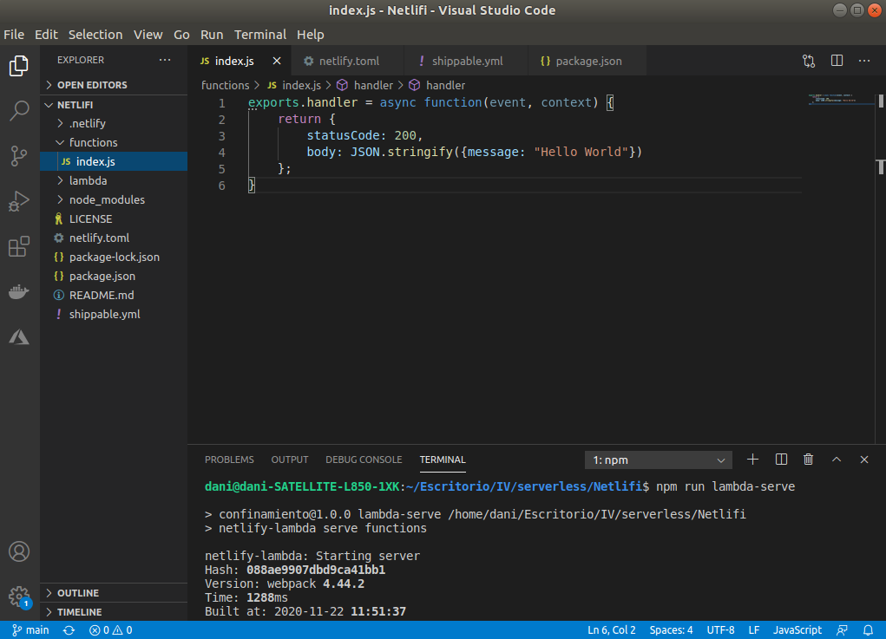
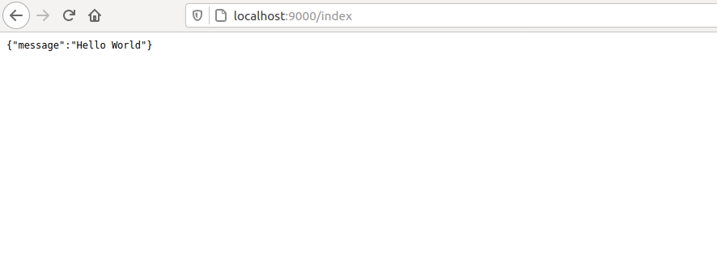

## Ejercicio 1
**Darse de alta en Vercel y Firebase, y descargarse los SDKs para poder trabajar con ellos localmente.**

Nos registramos en Vercel y Firebase

instalamos sdk para trabajar localmente

## Ejercicio 2
**Tomar alguna de las funciones de prueba de Vercel, y hacer despliegues de prueba con el mismo.**

vemos el despliegue

## Ejercicio 3
**Tomar alguna de las funciones de prueba de Netlify, y hacer despliegues de prueba con el mismo.**

despliegue en local con sdk
